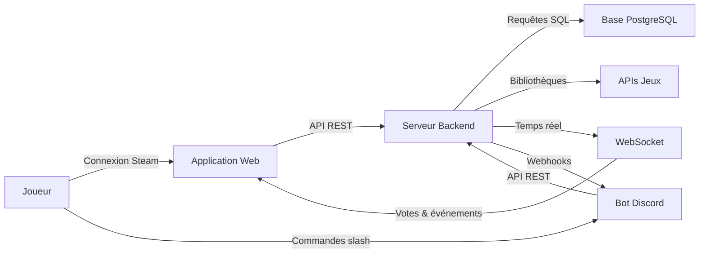
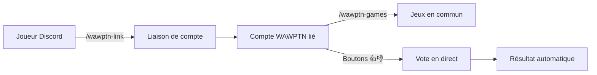
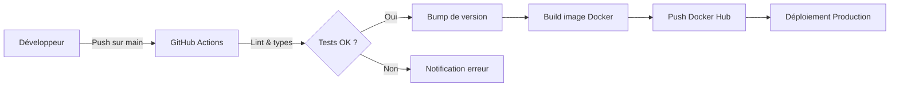

# WAWPTN — What Are We Playing Tonight?

Application web qui aide un groupe d'amis à choisir ensemble à quel jeu vidéo jouer ce soir. Fonctionne avec Steam, Epic Games, GOG et directement depuis Discord.

## Table des matières

- [À quoi sert ce produit ?](#à-quoi-sert-ce-produit-)
- [Fonctionnalités principales](#fonctionnalités-principales)
- [Comment ça fonctionne](#comment-ça-fonctionne)
- [Bot Discord](#bot-discord)
- [Environnements](#environnements)
- [Déploiement](#déploiement)
- [Stack technique](#stack-technique)
- [Documentation complémentaire](#documentation-complémentaire)

### Documentation technique

| Document | Description |
|----------|-------------|
| [Architecture API](docs/api-architecture.md) | Routes REST, événements WebSocket, API Discord et flux de vote |
| [Schéma de base de données](docs/database-schema.md) | Structure des tables et leurs relations |
| [Intégration Steam](docs/steam-integration.md) | Authentification OpenID 2.0, synchronisation et protections |
| [Bot Discord](docs/discord-bot.md) | Architecture du bot, commandes slash et flux de vote Discord |

## À quoi sert ce produit ?

- **Trouver un jeu commun** parmi les bibliothèques de tous les membres du groupe
- **Supporter plusieurs plateformes** — Steam, Epic Games, GOG Galaxy- **Créer des groupes** et inviter vos amis via un lien sécurisé à usage limité
- **Voter** pour ou contre chaque jeu proposé, depuis le site ou depuis Discord
- **Suivre en temps réel** l'avancement des votes de chaque participant
- **Lancer le jeu choisi** directement depuis Steam une fois le résultat révélé

## Fonctionnalités principales

- **Connexion via Steam** — Authentification unique par votre compte Steam
- **Multi-plateforme** — Liez vos comptes Epic Games et GOG pour élargir la liste de jeux
- **Gestion de groupes** — Création, invitation par lien sécurisé avec expiration
- **Détection des jeux communs** — Calcul automatique des jeux partagés entre les membres
- **Sessions de vote** — Vote pouce haut / pouce bas sur chaque jeu commun
- **Votes planifiés** — Programmez une session qui se clôture automatiquement
- **Bot Discord** — Votez et consultez les résultats directement dans un canal Discord
- **Temps réel** — Suivi en direct de la progression des votes via WebSocket
- **Révélation du résultat** — Affichage du jeu gagnant avec lancement Steam en un clic

## Comment ça fonctionne

Le joueur se connecte via Steam. L'application récupère ses bibliothèques de jeux (Steam, Epic, GOG). Un groupe est créé, le serveur calcule les jeux communs. Les membres votent en temps réel via le site web ou le bot Discord. Le résultat est révélé à tous simultanément.

## Bot Discord

Le bot Discord permet de voter et de consulter les résultats sans quitter Discord.

- `/wawptn-setup` — Lie un canal Discord à un groupe WAWPTN
- `/wawptn-link` — Lie votre compte Discord à votre compte WAWPTN
- `/wawptn-games` — Affiche les jeux en commun du groupe
- **Vote par boutons** — Votez directement sur les embeds Discord
- **Notifications automatiques** — Le canal reçoit les créations de session et les résultats

## Environnements

| Environnement | URL | Description |
|---------------|-----|-------------|
| Développement | `http://localhost:5173` (front) / `http://localhost:3000` (API) | Environnement local |
| Production | `https://wawptn.battistella.ovh` | Environnement de production |

## Déploiement

Le pipeline CI/CD (Intégration et Déploiement Continus) se déclenche à chaque push sur `main`. GitHub Actions vérifie le code, incrémente la version, construit l'image Docker multi-architecture et la publie sur Docker Hub. Watchtower met à jour automatiquement les conteneurs en production. Traefik gère le routage HTTPS.

L'image Docker contient le backend, le frontend et le bot Discord. En production, deux services tournent : le serveur principal et le bot Discord (sidecar).

## Stack technique

- **Frontend :** React 19, TypeScript, TailwindCSS v4, Zustand, Framer Motion
- **Backend :** Node.js 24, Express 5, Socket.io, Zod
- **Bot Discord :** Discord.js 14, TypeScript
- **Base de données :** PostgreSQL 16, Knex.js
- **Infrastructure :** Docker, Docker Compose, Traefik, GitHub Actions CI/CD

## Documentation complémentaire

- [Architecture API](docs/api-architecture.md) — Routes REST, événements WebSocket, API Discord et flux de vote
- [Schéma de base de données](docs/database-schema.md) — Structure des tables et leurs relations
- [Intégration Steam](docs/steam-integration.md) — Authentification OpenID 2.0, synchronisation et protections
- [Bot Discord](docs/discord-bot.md) — Architecture du bot, commandes slash et flux de vote Discord
