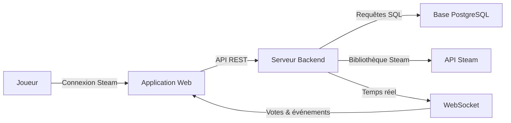
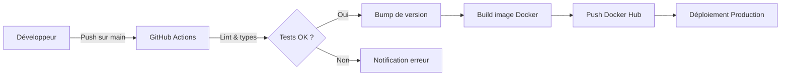

# WAWPTN — What Are We Playing Tonight?

Application web qui aide un groupe d'amis à choisir ensemble à quel jeu vidéo jouer ce soir, en se basant sur leurs bibliothèques Steam.

## Table des matières

- [À quoi sert ce produit ?](#à-quoi-sert-ce-produit-)
- [Fonctionnalités principales](#fonctionnalités-principales)
- [Comment ça fonctionne](#comment-ça-fonctionne)
- [Environnements](#environnements)
- [Déploiement](#déploiement)
- [Stack technique](#stack-technique)
- [Documentation complémentaire](#documentation-complémentaire)

### Documentation technique

| Document | Description |
|----------|-------------|
| [Architecture API](docs/api-architecture.md) | Routes REST, événements WebSocket et flux de vote |
| [Schéma de base de données](docs/database-schema.md) | Structure des 8 tables et leurs relations |
| [Intégration Steam](docs/steam-integration.md) | Authentification OpenID 2.0, synchronisation et protections |

## À quoi sert ce produit ?

- **Trouver un jeu commun** parmi les bibliothèques Steam de tous les membres du groupe
- **Créer des groupes** et inviter vos amis via un lien sécurisé à usage limité
- **Voter** pour ou contre chaque jeu proposé
- **Suivre en temps réel** l'avancement des votes de chaque participant
- **Lancer le jeu choisi** directement depuis Steam une fois le résultat révélé

## Fonctionnalités principales

- **Connexion via Steam** — Authentification unique par votre compte Steam
- **Gestion de groupes** — Création, invitation par lien sécurisé avec expiration
- **Détection des jeux communs** — Calcul automatique des jeux partagés par tous les membres
- **Sessions de vote** — Vote pouce haut / pouce bas sur chaque jeu commun
- **Temps réel** — Suivi en direct de la progression des votes via WebSocket
- **Révélation du résultat** — Affichage du jeu gagnant avec lancement Steam en un clic

## Comment ça fonctionne

Le joueur se connecte via son compte Steam. L'application récupère sa bibliothèque de jeux. Lorsqu'un groupe est créé, le serveur calcule les jeux communs. Les membres votent en temps réel grâce aux WebSocket. Le résultat est révélé à tous simultanément.

## Environnements

| Environnement | URL | Description |
|---------------|-----|-------------|
| Développement | `http://localhost:5173` (front) / `http://localhost:3000` (API) | Environnement local |
| Production | `https://wawptn.battistella.ovh` | Environnement de production |

## Déploiement

Le pipeline CI/CD (Intégration et Déploiement Continus) se déclenche à chaque push sur `main`. GitHub Actions vérifie le code, incrémente la version, construit l'image Docker multi-architecture et la publie sur Docker Hub. Watchtower met à jour automatiquement le conteneur en production. Traefik gère le routage HTTPS.

## Stack technique

- **Frontend :** React 19, TypeScript, TailwindCSS v4, Zustand, Framer Motion, shadcn/ui
- **Backend :** Node.js 24, Express 5, Better Auth, Socket.io, Zod
- **Base de données :** PostgreSQL 16, Knex.js
- **Infrastructure :** Docker, Docker Compose, Traefik, GitHub Actions CI/CD

## Documentation complémentaire

- [Architecture API](docs/api-architecture.md) — Routes REST, événements WebSocket et flux de vote
- [Schéma de base de données](docs/database-schema.md) — Structure des 8 tables et leurs relations
- [Intégration Steam](docs/steam-integration.md) — Authentification OpenID 2.0, synchronisation et protections
