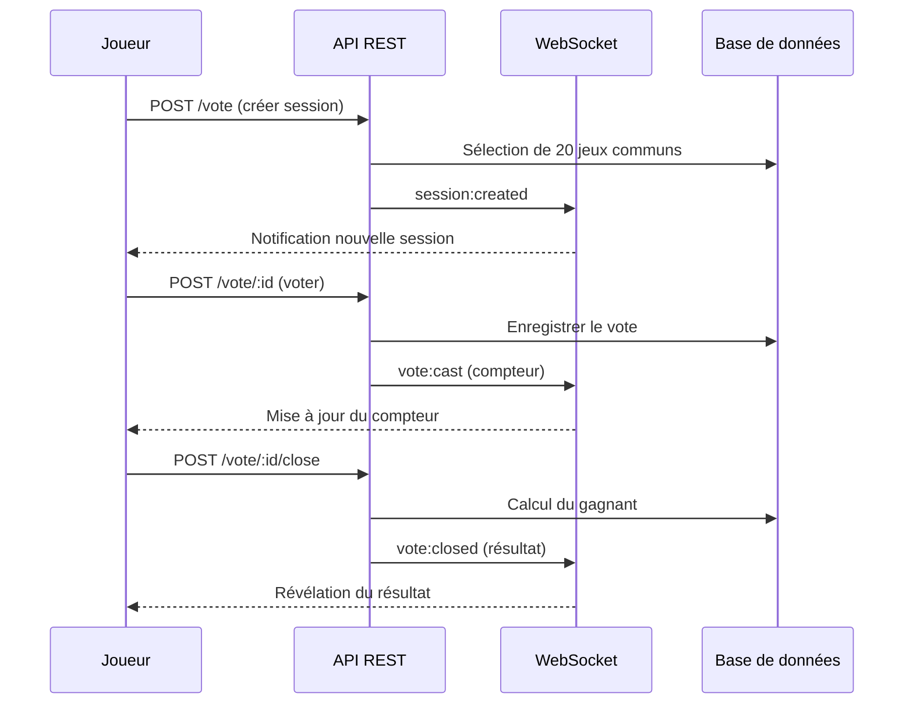

# Architecture API

Vue d'ensemble des routes REST et des événements WebSocket de WAWPTN. Ce document s'adresse aux développeurs et au Product Owner souhaitant comprendre les interactions entre le frontend et le backend.

## Routes REST

Toutes les routes sont préfixées par `/api`.

### Authentification

| Méthode | Route | Description |
|---------|-------|-------------|
| GET | `/api/auth/steam/login` | Redirige vers la page de connexion Steam |
| GET | `/api/auth/steam/callback` | Callback après authentification Steam |
| GET | `/api/auth/me` | Récupère l'utilisateur connecté |
| POST | `/api/auth/logout` | Déconnexion et suppression de la session |

### Groupes

| Méthode | Route | Description |
|---------|-------|-------------|
| GET | `/api/groups` | Liste les groupes de l'utilisateur |
| GET | `/api/groups/:id` | Détail d'un groupe avec ses membres |
| POST | `/api/groups` | Crée un nouveau groupe |
| POST | `/api/groups/:id/invite` | Génère un nouveau lien d'invitation |
| POST | `/api/groups/join` | Rejoint un groupe via un token d'invitation |
| DELETE | `/api/groups/:id/members/:userId` | Quitte un groupe ou exclut un membre |
| GET | `/api/groups/:id/common-games` | Liste les jeux communs du groupe |
| POST | `/api/groups/:id/sync` | Synchronise les bibliothèques Steam des membres |

### Vote

| Méthode | Route | Description |
|---------|-------|-------------|
| GET | `/api/groups/:groupId/vote` | Session de vote active du groupe |
| POST | `/api/groups/:groupId/vote` | Crée une nouvelle session de vote |
| POST | `/api/groups/:groupId/vote/:sessionId` | Enregistre un vote (pour ou contre) |
| POST | `/api/groups/:groupId/vote/:sessionId/close` | Clôture le vote et calcule le gagnant |
| GET | `/api/groups/:groupId/vote/history` | Historique des 10 dernières sessions |

## Flux d'une session de vote

Le créateur de la session ou le propriétaire du groupe peut clôturer le vote. Le jeu ayant le plus de votes positifs gagne. En cas d'égalité, un tirage au sort départage les candidats.

## Événements WebSocket

Le serveur WebSocket utilise Socket.io sur le chemin `/socket.io`. L'authentification se fait par cookie de session.

### Événements client vers serveur

| Événement | Données | Description |
|-----------|---------|-------------|
| `group:join` | `groupId` | Rejoint la room WebSocket du groupe |
| `group:leave` | `groupId` | Quitte la room WebSocket du groupe |

### Événements serveur vers client

| Événement | Données | Description |
|-----------|---------|-------------|
| `member:joined` | `{ groupId, user }` | Un membre a rejoint le groupe |
| `member:left` | `{ groupId, userId }` | Un membre a quitté le groupe |
| `library:synced` | `{ groupId, userId }` | Bibliothèque Steam synchronisée |
| `session:created` | `{ sessionId, groupId, createdBy }` | Nouvelle session de vote créée |
| `vote:cast` | `{ sessionId, userId, voterCount }` | Vote enregistré (compteur uniquement) |
| `vote:closed` | `{ sessionId, result }` | Session clôturée avec le résultat |

> **Détail technique** — Les votes individuels ne sont jamais diffusés. Seul le compteur de votants est transmis pour préserver le secret du vote jusqu'à la révélation.

## Authentification des requêtes

- **REST** — Cookie `wawptn.session_token` vérifié par le middleware d'authentification
- **WebSocket** — Cookie transmis via le handshake, vérifié à chaque connexion
- **Session** — Durée de 7 jours, renouvelée quotidiennement
