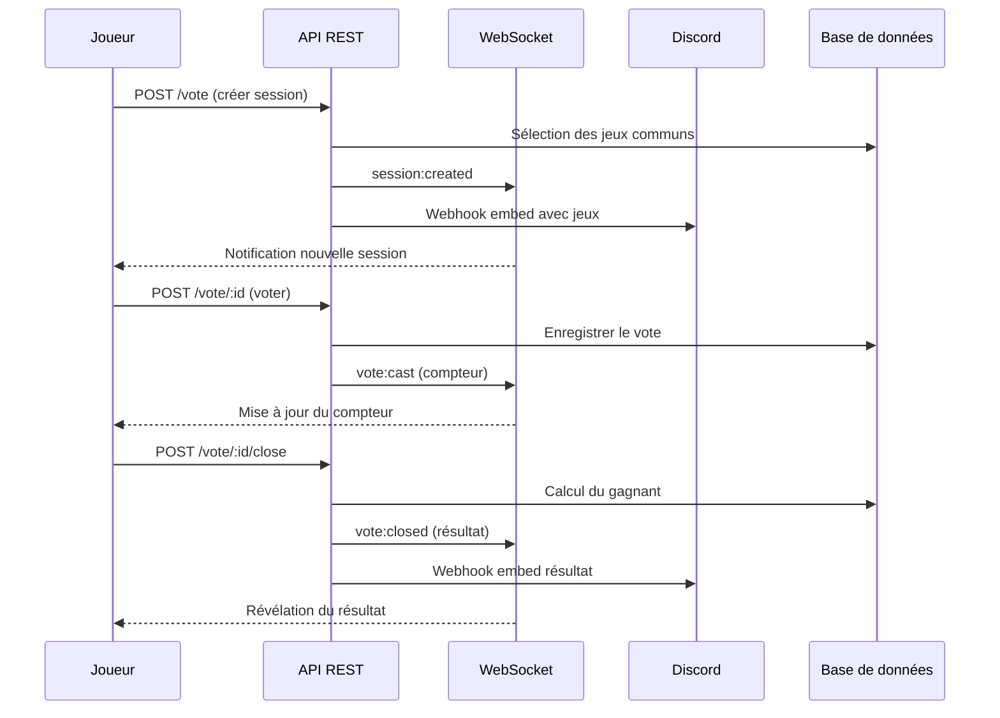
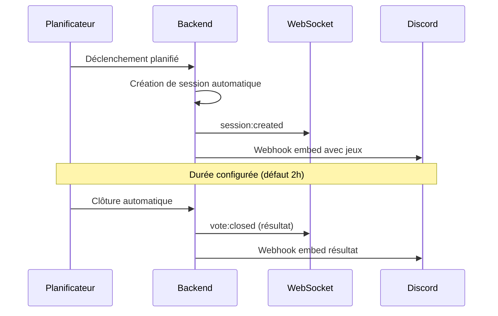

# Architecture API

Vue d'ensemble des routes REST, des événements WebSocket et de l'API Discord de WAWPTN. Ce document s'adresse aux développeurs et au Product Owner souhaitant comprendre les interactions entre le frontend, le backend et le bot Discord.

## Routes REST

Toutes les routes sont préfixées par `/api`.

### Authentification

| Méthode | Route | Description |
|---------|-------|-------------|
| GET | `/api/auth/steam/login` | Redirige vers la page de connexion Steam |
| GET | `/api/auth/steam/callback` | Callback après authentification Steam |
| GET | `/api/auth/me` | Récupère l'utilisateur connecté et ses plateformes liées |
| POST | `/api/auth/logout` | Déconnexion et suppression de la session |
| GET | `/api/auth/epic/link` | Initie la liaison du compte Epic Games |
| GET | `/api/auth/epic/callback` | Callback après liaison Epic Games |
| GET | `/api/auth/gog/link` | Initie la liaison du compte GOG Galaxy |
| GET | `/api/auth/gog/callback` | Callback après liaison GOG Galaxy |
| DELETE | `/api/auth/:provider/unlink` | Supprime la liaison d'un compte plateforme |

### Groupes

| Méthode | Route | Description |
|---------|-------|-------------|
| GET | `/api/groups` | Liste les groupes de l'utilisateur |
| GET | `/api/groups/:id` | Détail d'un groupe avec ses membres |
| POST | `/api/groups` | Crée un nouveau groupe |
| PATCH | `/api/groups/:id` | Renomme un groupe |
| DELETE | `/api/groups/:id` | Supprime un groupe |
| POST | `/api/groups/:id/invite` | Génère un nouveau lien d'invitation |
| POST | `/api/groups/join` | Rejoint un groupe via un token d'invitation |
| DELETE | `/api/groups/:id/members/:userId` | Quitte un groupe ou exclut un membre |
| PATCH | `/api/groups/:id/notifications` | Active ou désactive les notifications pour le membre |
| PATCH | `/api/groups/:id/auto-vote` | Configure le planning de vote automatique du groupe |
| GET | `/api/groups/:id/common-games` | Liste les jeux communs du groupe |
| POST | `/api/groups/:id/common-games/preview` | Prévisualise les jeux communs pour un sous-ensemble de membres |
| GET | `/api/groups/:id/stats` | Statistiques et historique de vote du groupe |
| POST | `/api/groups/:id/sync` | Synchronise les bibliothèques de tous les membres |
| GET | `/api/groups/:id/recommendations` | Recommandations de jeux basées sur l'historique de votes |

### Vote

| Méthode | Route | Description |
|---------|-------|-------------|
| GET | `/api/groups/:groupId/vote` | Session de vote active du groupe |
| POST | `/api/groups/:groupId/vote` | Crée une session de vote avec participants sélectionnés |
| POST | `/api/groups/:groupId/vote/:sessionId` | Enregistre un vote (pour ou contre) |
| POST | `/api/groups/:groupId/vote/:sessionId/close` | Clôture le vote et calcule le gagnant |
| GET | `/api/groups/:groupId/vote/history` | Historique des 10 dernières sessions |

### Administration (requiert le rôle admin)

Routes accessibles uniquement aux utilisateurs ayant `is_admin = true`.

| Méthode | Route | Description |
|---------|-------|-------------|
| GET | `/api/admin/bot-settings` | Récupère les paramètres du bot Discord |
| PATCH | `/api/admin/bot-settings` | Modifie les paramètres du bot Discord |
| GET | `/api/admin/users` | Liste tous les utilisateurs |
| PATCH | `/api/admin/users/:id/admin` | Attribue ou révoque le rôle administrateur |
| GET | `/api/admin/personas` | Liste toutes les personas du bot |
| POST | `/api/admin/personas` | Crée une nouvelle persona |
| PATCH | `/api/admin/personas/:id` | Modifie une persona existante |
| DELETE | `/api/admin/personas/:id` | Supprime une persona (sauf celles par défaut) |
| PATCH | `/api/admin/personas/:id/toggle` | Active ou désactive une persona |
| GET | `/api/admin/stats` | Statistiques globales (utilisateurs, groupes, sessions) |

### Discord (feature-flagged)

Routes activées uniquement si `DISCORD_BOT_API_SECRET` est configuré. Authentification via header `Authorization: Bot <secret>`.

| Méthode | Route | Auth | Description |
|---------|-------|------|-------------|
| POST | `/api/discord/setup` | Bot | Lie un canal Discord à un groupe |
| GET | `/api/discord/link/status` | Bot | Vérifie si un utilisateur Discord est lié |
| POST | `/api/discord/link` | Bot | Génère un code de liaison temporaire |
| POST | `/api/discord/link/confirm` | Utilisateur | Confirme la liaison avec un code |
| POST | `/api/discord/vote` | Bot | Enregistre un vote depuis Discord |
| GET | `/api/discord/games` | Bot | Liste les jeux communs d'un canal lié |
| GET | `/api/discord/stats` | Bot | Classement et statistiques d'un groupe (organisateurs, votants, jeux gagnants, séries) |
| POST | `/api/discord/webhook` | Utilisateur | Configure le webhook Discord d'un groupe |

### Invitation (public)

| Méthode | Route | Description |
|---------|-------|-------------|
| GET | `/invite/:token` | Prévisualisation du lien d'invitation (meta OG pour Discord) |

## Flux d'une session de vote

Le créateur de la session ou le propriétaire du groupe peut clôturer le vote. Le jeu ayant le plus de votes positifs gagne. En cas d'égalité, un tirage au sort départage les candidats. Les notifications Discord sont envoyées en parallèle, sans bloquer le flux principal.

## Flux de vote automatique

Chaque groupe peut configurer un planning de vote automatique (expression cron). Le planificateur crée la session et la clôture automatiquement après la durée configurée.

## Événements WebSocket

Le serveur WebSocket utilise Socket.io sur le chemin `/socket.io`. L'authentification se fait par cookie de session.

### Événements client vers serveur

| Événement | Données | Description |
|-----------|---------|-------------|
| `group:join` | `groupId` | Rejoint la room WebSocket du groupe |
| `group:leave` | `groupId` | Quitte la room WebSocket du groupe |

### Événements serveur vers client

| Événement | Données | Description |
|-----------|---------|-------------|
| `member:joined` | `{ groupId, user }` | Un membre a rejoint le groupe |
| `member:left` | `{ groupId, userId }` | Un membre a quitté le groupe |
| `member:kicked` | `{ groupId, userId }` | Un membre a été exclu |
| `group:deleted` | `{ groupId, groupName }` | Le groupe a été supprimé |
| `group:renamed` | `{ groupId, newName }` | Le groupe a été renommé |
| `library:synced` | `{ groupId, userId, gameCount }` | Bibliothèque synchronisée |
| `session:created` | `{ sessionId, groupId, createdBy, participantIds, scheduledAt }` | Nouvelle session de vote |
| `vote:cast` | `{ sessionId, userId, voterCount, totalParticipants }` | Vote enregistré (compteur) |
| `vote:closed` | `{ sessionId, result }` | Session clôturée avec le résultat |
| `group:presence` | `{ onlineUserIds }` | Liste des membres connectés |
| `member:online` | `{ groupId, userId }` | Un membre s'est connecté |
| `member:offline` | `{ groupId, userId }` | Un membre s'est déconnecté |

> **Détail technique** — Les votes individuels ne sont jamais diffusés. Seul le compteur de votants est transmis pour préserver le secret du vote jusqu'à la révélation.

## Authentification des requêtes

| Canal | Mécanisme | Détail |
|-------|-----------|--------|
| REST (utilisateur) | Cookie signé `wawptn.session_token` | Vérifié par le middleware `requireAuth` |
| WebSocket | Cookie transmis via le handshake | Vérifié à chaque connexion |
| REST (bot Discord) | Header `Authorization: Bot <secret>` | Vérifié par le middleware `requireBotAuth` |
| REST (admin) | Cookie + vérification `is_admin` | Vérifié par le middleware `requireAdmin` |
| Session | Durée de 7 jours | Token de 32 octets aléatoires |

> **Détail technique** — Le middleware bot résout automatiquement le header `X-Discord-User-Id` vers un `userId` WAWPTN via la table `discord_links`.
