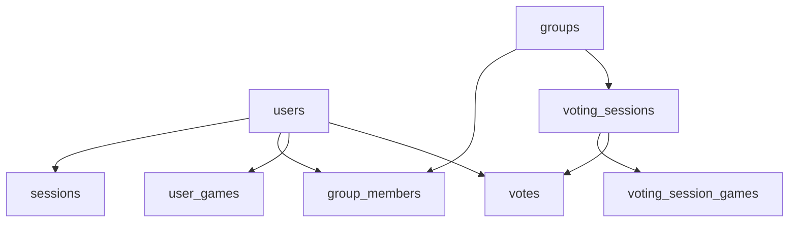

# Schéma de base de données

Structure des tables PostgreSQL de WAWPTN. Ce document décrit les entités, leurs relations et les contraintes d'intégrité.

## Vue d'ensemble

L'utilisateur est au centre du modèle. Il possède une session d'authentification, appartient à des groupes, dispose d'une bibliothèque de jeux Steam et participe aux votes.

## Tables

### users

Utilisateurs authentifiés via Steam.

| Colonne | Type | Contrainte | Description |
|---------|------|------------|-------------|
| `id` | UUID | PK, auto | Identifiant unique |
| `steam_id` | VARCHAR | UNIQUE, NOT NULL | Identifiant Steam |
| `display_name` | VARCHAR | NOT NULL | Pseudo Steam |
| `avatar_url` | VARCHAR | — | URL de l'avatar |
| `profile_url` | VARCHAR | — | URL du profil Steam |
| `email` | VARCHAR | — | Email (optionnel) |
| `library_visible` | BOOLEAN | défaut `true` | Bibliothèque accessible |
| `created_at` | TIMESTAMP | auto | Date de création |
| `updated_at` | TIMESTAMP | auto | Dernière modification |

### sessions

Sessions d'authentification liées aux utilisateurs.

| Colonne | Type | Contrainte | Description |
|---------|------|------------|-------------|
| `id` | UUID | PK, auto | Identifiant unique |
| `user_id` | UUID | FK → users, CASCADE | Utilisateur associé |
| `token` | VARCHAR | UNIQUE, NOT NULL | Token de session |
| `expires_at` | TIMESTAMP | NOT NULL | Date d'expiration |
| `created_at` | TIMESTAMP | auto | Date de création |
| `updated_at` | TIMESTAMP | auto | Dernière modification |

> **Détail technique** — Index sur `token` et `expires_at` pour des recherches rapides.

### groups

Groupes de joueurs.

| Colonne | Type | Contrainte | Description |
|---------|------|------------|-------------|
| `id` | UUID | PK, auto | Identifiant unique |
| `name` | VARCHAR | NOT NULL | Nom du groupe |
| `created_by` | UUID | FK → users, CASCADE | Créateur du groupe |
| `invite_token_hash` | VARCHAR | — | Hash SHA-256 du token d'invitation |
| `invite_expires_at` | TIMESTAMP | — | Expiration de l'invitation (72h) |
| `invite_use_count` | INTEGER | défaut `0` | Nombre d'utilisations |
| `invite_max_uses` | INTEGER | défaut `10` | Utilisations maximales |
| `common_game_threshold` | INTEGER | nullable | Seuil de jeux communs |
| `created_at` | TIMESTAMP | auto | Date de création |
| `updated_at` | TIMESTAMP | auto | Dernière modification |

### group_members

Appartenance des utilisateurs aux groupes.

| Colonne | Type | Contrainte | Description |
|---------|------|------------|-------------|
| `group_id` | UUID | PK, FK → groups, CASCADE | Groupe |
| `user_id` | UUID | PK, FK → users, CASCADE | Membre |
| `role` | ENUM | `owner` ou `member` | Rôle dans le groupe |
| `joined_at` | TIMESTAMP | auto | Date d'adhésion |

> **Détail technique** — Clé primaire composite `(group_id, user_id)` pour empêcher les doublons.

### user_games

Cache local des bibliothèques Steam.

| Colonne | Type | Contrainte | Description |
|---------|------|------------|-------------|
| `user_id` | UUID | PK, FK → users, CASCADE | Propriétaire |
| `steam_app_id` | INTEGER | PK, NOT NULL | Identifiant Steam du jeu |
| `game_name` | VARCHAR | NOT NULL | Nom du jeu |
| `header_image_url` | VARCHAR | — | URL de l'image du jeu |
| `synced_at` | TIMESTAMP | auto | Dernière synchronisation |

> **Détail technique** — Clé primaire composite `(user_id, steam_app_id)`. L'upsert met à jour les données si le jeu existe déjà.

### voting_sessions

Sessions de vote au sein d'un groupe.

| Colonne | Type | Contrainte | Description |
|---------|------|------------|-------------|
| `id` | UUID | PK, auto | Identifiant unique |
| `group_id` | UUID | FK → groups, CASCADE | Groupe concerné |
| `status` | ENUM | `open` ou `closed` | État de la session |
| `created_by` | UUID | FK → users, CASCADE | Initiateur du vote |
| `winning_game_app_id` | INTEGER | — | Jeu gagnant (après clôture) |
| `winning_game_name` | VARCHAR | — | Nom du jeu gagnant |
| `created_at` | TIMESTAMP | auto | Date de création |
| `closed_at` | TIMESTAMP | — | Date de clôture |

> **Détail technique** — Index composite sur `(group_id, status)` pour retrouver rapidement la session active.

### voting_session_games

Jeux sélectionnés pour une session de vote (maximum 20).

| Colonne | Type | Contrainte | Description |
|---------|------|------------|-------------|
| `session_id` | UUID | PK, FK → voting_sessions, CASCADE | Session |
| `steam_app_id` | INTEGER | PK, NOT NULL | Identifiant Steam du jeu |
| `game_name` | VARCHAR | NOT NULL | Nom du jeu |
| `header_image_url` | VARCHAR | — | URL de l'image |

### votes

Votes individuels des membres sur chaque jeu.

| Colonne | Type | Contrainte | Description |
|---------|------|------------|-------------|
| `session_id` | UUID | FK → voting_sessions, CASCADE | Session |
| `user_id` | UUID | FK → users, CASCADE | Votant |
| `steam_app_id` | INTEGER | NOT NULL | Jeu concerné |
| `vote` | BOOLEAN | NOT NULL | `true` = pour, `false` = contre |
| `created_at` | TIMESTAMP | auto | Date du vote |

> **Détail technique** — Contrainte UNIQUE sur `(session_id, user_id, steam_app_id)` pour garantir un seul vote par joueur et par jeu. L'upsert permet de changer d'avis.

## Migrations

Les migrations sont gérées par **Knex.js** dans `packages/backend/migrations/`.

| Fichier | Description |
|---------|-------------|
| `20260306_initial_schema.ts` | Création de toutes les tables |
