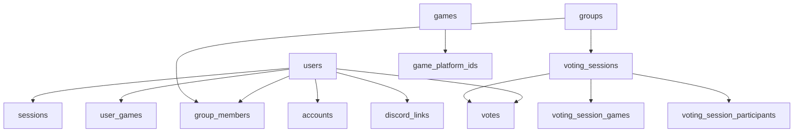

# Schéma de base de données

Structure des tables PostgreSQL de WAWPTN. Ce document décrit les entités, leurs relations et les contraintes d'intégrité.

## Vue d'ensemble

L'utilisateur est au centre du modèle. Il possède une session d'authentification, appartient à des groupes, dispose de bibliothèques de jeux multi-plateformes et participe aux votes. Le schéma `games` centralise les jeux canoniques avec des identifiants par plateforme.

## Tables

### users

Utilisateurs authentifiés via Steam.

| Colonne | Type | Contrainte | Description |
|---------|------|------------|-------------|
| `id` | UUID | PK, auto | Identifiant unique |
| `steam_id` | VARCHAR | UNIQUE, NOT NULL | Identifiant Steam |
| `display_name` | VARCHAR | NOT NULL | Pseudo Steam |
| `avatar_url` | VARCHAR | — | URL de l'avatar |
| `profile_url` | VARCHAR | — | URL du profil Steam |
| `email` | VARCHAR | — | Email (optionnel) |
| `library_visible` | BOOLEAN | défaut `true` | Bibliothèque accessible |
| `created_at` | TIMESTAMP | auto | Date de création |
| `updated_at` | TIMESTAMP | auto | Dernière modification |

### sessions

Sessions d'authentification liées aux utilisateurs.

| Colonne | Type | Contrainte | Description |
|---------|------|------------|-------------|
| `id` | UUID | PK, auto | Identifiant unique |
| `user_id` | UUID | FK → users, CASCADE | Utilisateur associé |
| `token` | VARCHAR | UNIQUE, NOT NULL | Token de session |
| `expires_at` | TIMESTAMP | NOT NULL | Date d'expiration |
| `created_at` | TIMESTAMP | auto | Date de création |

> **Détail technique** — Index sur `token` et `expires_at` pour des recherches rapides.

### accounts

Comptes de plateformes de jeux liés (Epic Games, GOG Galaxy).

| Colonne | Type | Contrainte | Description |
|---------|------|------------|-------------|
| `user_id` | UUID | FK → users, CASCADE | Utilisateur |
| `provider_id` | VARCHAR | NOT NULL | Plateforme (`steam`, `epic`, `gog`) |
| `account_id` | VARCHAR | NOT NULL | Identifiant sur la plateforme |
| `access_token` | TEXT | — | Token d'accès chiffré |
| `refresh_token` | TEXT | — | Token de rafraîchissement chiffré |
| `access_token_expires_at` | TIMESTAMP | — | Expiration du token |
| `status` | VARCHAR | — | État de la liaison |
| `created_at` | TIMESTAMP | auto | Date de liaison |
| `updated_at` | TIMESTAMP | auto | Dernière modification |

> **Détail technique** — Contrainte UNIQUE sur `(provider_id, account_id)`. Les tokens sont chiffrés au repos.

### groups

Groupes de joueurs.

| Colonne | Type | Contrainte | Description |
|---------|------|------------|-------------|
| `id` | UUID | PK, auto | Identifiant unique |
| `name` | VARCHAR | NOT NULL | Nom du groupe |
| `created_by` | UUID | FK → users, CASCADE | Créateur du groupe |
| `invite_token_hash` | VARCHAR | — | Hash SHA-256 du token d'invitation |
| `invite_expires_at` | TIMESTAMP | — | Expiration de l'invitation (72h) |
| `invite_use_count` | INTEGER | défaut `0` | Nombre d'utilisations |
| `invite_max_uses` | INTEGER | défaut `10` | Utilisations maximales |
| `common_game_threshold` | INTEGER | nullable | Seuil de jeux communs |
| `discord_channel_id` | VARCHAR | nullable | Canal Discord lié |
| `discord_guild_id` | VARCHAR | nullable | Serveur Discord lié |
| `discord_webhook_url` | TEXT | nullable | URL du webhook Discord |
| `created_at` | TIMESTAMP | auto | Date de création |
| `updated_at` | TIMESTAMP | auto | Dernière modification |

### group_members

Appartenance des utilisateurs aux groupes.

| Colonne | Type | Contrainte | Description |
|---------|------|------------|-------------|
| `group_id` | UUID | PK, FK → groups, CASCADE | Groupe |
| `user_id` | UUID | PK, FK → users, CASCADE | Membre |
| `role` | ENUM | `owner` ou `member` | Rôle dans le groupe |
| `joined_at` | TIMESTAMP | auto | Date d'adhésion |

> **Détail technique** — Clé primaire composite `(group_id, user_id)` pour empêcher les doublons.

### games

Catalogue canonique des jeux, indépendant des plateformes.

| Colonne | Type | Contrainte | Description |
|---------|------|------------|-------------|
| `id` | UUID | PK, auto | Identifiant unique |
| `canonical_name` | VARCHAR | NOT NULL | Nom canonique du jeu |
| `cover_image_url` | VARCHAR | — | URL de l'image de couverture |
| `created_at` | TIMESTAMP | auto | Date de création |
| `updated_at` | TIMESTAMP | auto | Dernière modification |

### game_platform_ids

Correspondance entre jeux canoniques et identifiants par plateforme.

| Colonne | Type | Contrainte | Description |
|---------|------|------------|-------------|
| `game_id` | UUID | FK → games, CASCADE | Jeu canonique |
| `platform` | VARCHAR | NOT NULL | Plateforme (`steam`, `epic`, `gog`) |
| `platform_game_id` | VARCHAR | NOT NULL | Identifiant sur la plateforme |

> **Détail technique** — Contrainte UNIQUE sur `(platform, platform_game_id)`.

### game_metadata

Métadonnées enrichies depuis Steam.

| Colonne | Type | Contrainte | Description |
|---------|------|------------|-------------|
| `steam_app_id` | INTEGER | PK | Identifiant Steam |
| `categories` | JSONB | — | Catégories du jeu |
| `is_multiplayer` | BOOLEAN | — | Jeu multijoueur |
| `is_coop` | BOOLEAN | — | Jeu coopératif |
| `enriched_at` | TIMESTAMP | — | Date d'enrichissement |

### user_games

Cache local des bibliothèques de jeux (toutes plateformes).

| Colonne | Type | Contrainte | Description |
|---------|------|------------|-------------|
| `user_id` | UUID | FK → users, CASCADE | Propriétaire |
| `steam_app_id` | INTEGER | NOT NULL | Identifiant Steam du jeu |
| `game_id` | UUID | FK → games, nullable | Jeu canonique associé |
| `game_name` | VARCHAR | NOT NULL | Nom du jeu |
| `header_image_url` | VARCHAR | — | URL de l'image du jeu |
| `platform` | VARCHAR | défaut `steam` | Plateforme d'origine |
| `synced_at` | TIMESTAMP | auto | Dernière synchronisation |

> **Détail technique** — Clé primaire composite `(user_id, steam_app_id)`. L'upsert met à jour les données si le jeu existe déjà.

### voting_sessions

Sessions de vote au sein d'un groupe.

| Colonne | Type | Contrainte | Description |
|---------|------|------------|-------------|
| `id` | UUID | PK, auto | Identifiant unique |
| `group_id` | UUID | FK → groups, CASCADE | Groupe concerné |
| `status` | ENUM | `open` ou `closed` | État de la session |
| `created_by` | UUID | FK → users, CASCADE | Initiateur du vote |
| `winning_game_app_id` | INTEGER | — | Jeu gagnant (après clôture) |
| `winning_game_id` | UUID | — | Jeu canonique gagnant |
| `winning_game_name` | VARCHAR | — | Nom du jeu gagnant |
| `scheduled_at` | TIMESTAMP | nullable | Date de clôture automatique |
| `created_at` | TIMESTAMP | auto | Date de création |
| `closed_at` | TIMESTAMP | — | Date de clôture |

> **Détail technique** — Index composite sur `(group_id, status)`. Le champ `scheduled_at` permet la clôture automatique via un cron toutes les 15 secondes.

### voting_session_participants

Participants sélectionnés pour une session de vote.

| Colonne | Type | Contrainte | Description |
|---------|------|------------|-------------|
| `session_id` | UUID | PK, FK → voting_sessions, CASCADE | Session |
| `user_id` | UUID | PK, FK → users, CASCADE | Participant |

### voting_session_games

Jeux sélectionnés pour une session de vote.

| Colonne | Type | Contrainte | Description |
|---------|------|------------|-------------|
| `session_id` | UUID | PK, FK → voting_sessions, CASCADE | Session |
| `steam_app_id` | INTEGER | PK, NOT NULL | Identifiant Steam du jeu |
| `game_id` | UUID | nullable | Jeu canonique associé |
| `game_name` | VARCHAR | NOT NULL | Nom du jeu |
| `header_image_url` | VARCHAR | — | URL de l'image |

### votes

Votes individuels des membres sur chaque jeu.

| Colonne | Type | Contrainte | Description |
|---------|------|------------|-------------|
| `session_id` | UUID | FK → voting_sessions, CASCADE | Session |
| `user_id` | UUID | FK → users, CASCADE | Votant |
| `steam_app_id` | INTEGER | NOT NULL | Jeu concerné |
| `game_id` | UUID | nullable | Jeu canonique associé |
| `vote` | BOOLEAN | NOT NULL | `true` = pour, `false` = contre |
| `created_at` | TIMESTAMP | auto | Date du vote |

> **Détail technique** — Contrainte UNIQUE sur `(session_id, user_id, steam_app_id)` pour garantir un seul vote par joueur et par jeu. L'upsert permet de changer d'avis.

### discord_links

Liaison entre comptes Discord et comptes WAWPTN.

| Colonne | Type | Contrainte | Description |
|---------|------|------------|-------------|
| `user_id` | UUID | PK, FK → users, CASCADE | Utilisateur WAWPTN |
| `discord_id` | VARCHAR | UNIQUE, NOT NULL | Identifiant Discord |
| `discord_username` | VARCHAR | NOT NULL | Pseudo Discord |
| `linked_at` | TIMESTAMP | auto | Date de liaison |

### discord_link_codes

Codes temporaires pour le flux de liaison Discord.

| Colonne | Type | Contrainte | Description |
|---------|------|------------|-------------|
| `id` | UUID | PK, auto | Identifiant unique |
| `code` | VARCHAR(8) | UNIQUE, NOT NULL | Code alphanumérique |
| `discord_id` | VARCHAR | NOT NULL | Identifiant Discord |
| `discord_username` | VARCHAR | NOT NULL | Pseudo Discord |
| `expires_at` | TIMESTAMP | NOT NULL | Expiration (10 minutes) |
| `created_at` | TIMESTAMP | auto | Date de création |

## Migrations

Les migrations sont gérées par **Knex.js** dans `packages/backend/migrations/`.

| Fichier | Description |
|---------|-------------|
| `20260306_initial_schema.ts` | Création des tables de base |
| `20260308_better_auth_migration.ts` | Adaptation du schéma d'authentification (legacy name) |
| `20260308_games_schema_generalization.ts` | Catalogue de jeux canonique et multi-plateforme |
| `20260308_add_scheduled_at.ts` | Votes planifiés avec clôture automatique |
| `20260308_accounts_unique_constraints.ts` | Contraintes de liaison multi-plateforme |
| `20260308_epic_games_support.ts` | Support Epic Games |
| `20260314_discord_support.ts` | Tables Discord et colonnes de liaison |
