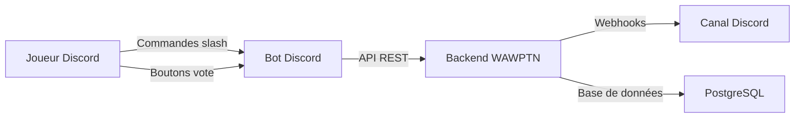
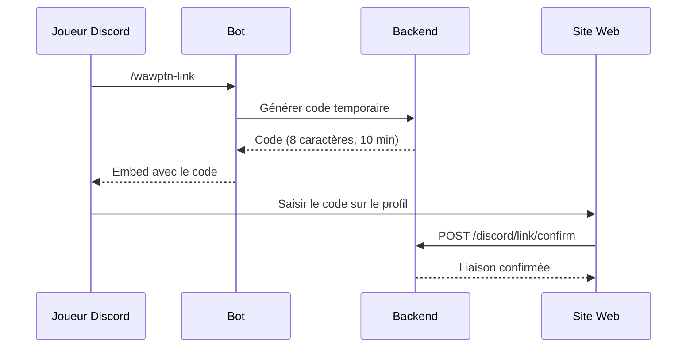
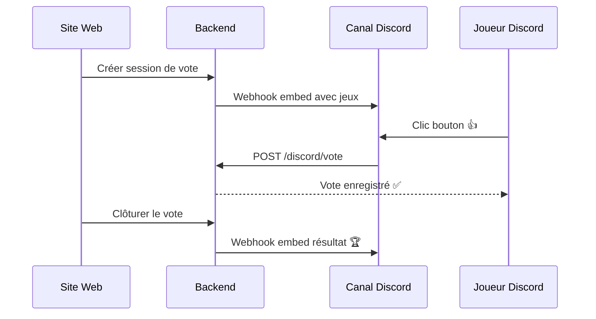

# Bot Discord

Architecture, commandes et flux de vote du bot Discord WAWPTN. Ce document s'adresse aux développeurs et au Product Owner souhaitant comprendre l'intégration Discord.

## Vue d'ensemble

Le bot Discord permet aux joueurs de voter sur les jeux et de consulter les résultats directement dans un canal Discord, sans ouvrir le site web.

Le bot est un processus séparé qui communique avec le backend via l'API HTTP interne. Les notifications (session créée, résultat du vote) sont envoyées directement par le backend via les webhooks Discord.

## Architecture technique

Le bot vit dans `packages/discord/` comme workspace séparé du monorepo.

| Composant | Rôle |
|-----------|------|
| Bot Discord.js | Gère les commandes slash et les interactions boutons |
| Backend API | Traite les votes et gère les données |
| Webhooks Discord | Envoient les notifications dans les canaux |

> **Détail technique** — Le bot et le backend partagent un secret (`DISCORD_BOT_API_SECRET`). Le bot envoie ce secret via le header `Authorization: Bot <secret>` et l'identifiant Discord via `X-Discord-User-Id`. Le middleware backend résout automatiquement l'utilisateur WAWPTN correspondant.

## Commandes slash

### /wawptn-setup

Lie un canal Discord à un groupe WAWPTN. Réservée aux membres ayant la permission de gérer les canaux.

- **Paramètre :** `group-id` — L'identifiant du groupe WAWPTN
- **Effet :** Le canal recevra les notifications de vote automatiquement

### /wawptn-link

Lie votre compte Discord à votre compte WAWPTN. Nécessaire pour voter depuis Discord.

Le joueur reçoit un code temporaire (valable 10 minutes). Il le saisit sur le site web depuis son profil authentifié. La liaison est alors permanente.

### /wawptn-games

Affiche la liste des jeux en commun du groupe lié au canal actuel.

## Vote par boutons

Lorsqu'une session de vote est créée sur le site, le backend envoie un embed riche dans le canal Discord lié. Chaque jeu apparaît avec un bouton 👍.

Les votes Discord sont traités exactement comme les votes web. Le même utilisateur peut voter depuis les deux canaux sans conflit, grâce à la contrainte d'unicité en base de données.

## Notifications automatiques

Le backend envoie deux types de notifications via webhook Discord :

| Événement | Contenu de l'embed |
|-----------|-------------------|
| Session créée | Liste des jeux, nom du créateur, boutons de vote |
| Vote clôturé | Jeu gagnant, image, nombre de votes, lien Steam |

> **Détail technique** — Les notifications sont envoyées de manière non-bloquante (`.catch()`). Un échec du webhook n'empêche pas le fonctionnement du vote.

## Déploiement

Le bot tourne comme un service séparé dans Docker Compose, utilisant la même image que le backend.

| Service | Commande | Réseau |
|---------|----------|--------|
| `wawptn` | Backend principal | `lan` |
| `wawptn-discord` | `node packages/discord/dist/index.js` | `lan` |

Le bot se connecte au backend via `http://wawptn:8080` (réseau Docker interne).

## Variables d'environnement

| Variable | Service | Description |
|----------|---------|-------------|
| `DISCORD_BOT_TOKEN` | Bot | Token du bot depuis le Developer Portal |
| `DISCORD_APPLICATION_ID` | Bot | ID de l'application Discord |
| `DISCORD_BOT_API_SECRET` | Bot + Backend | Secret partagé pour l'authentification |
| `BACKEND_URL` | Bot | URL interne du backend |

Le bot est **feature-flagged** : si `DISCORD_BOT_API_SECRET` n'est pas défini, les routes Discord sont désactivées côté backend.
