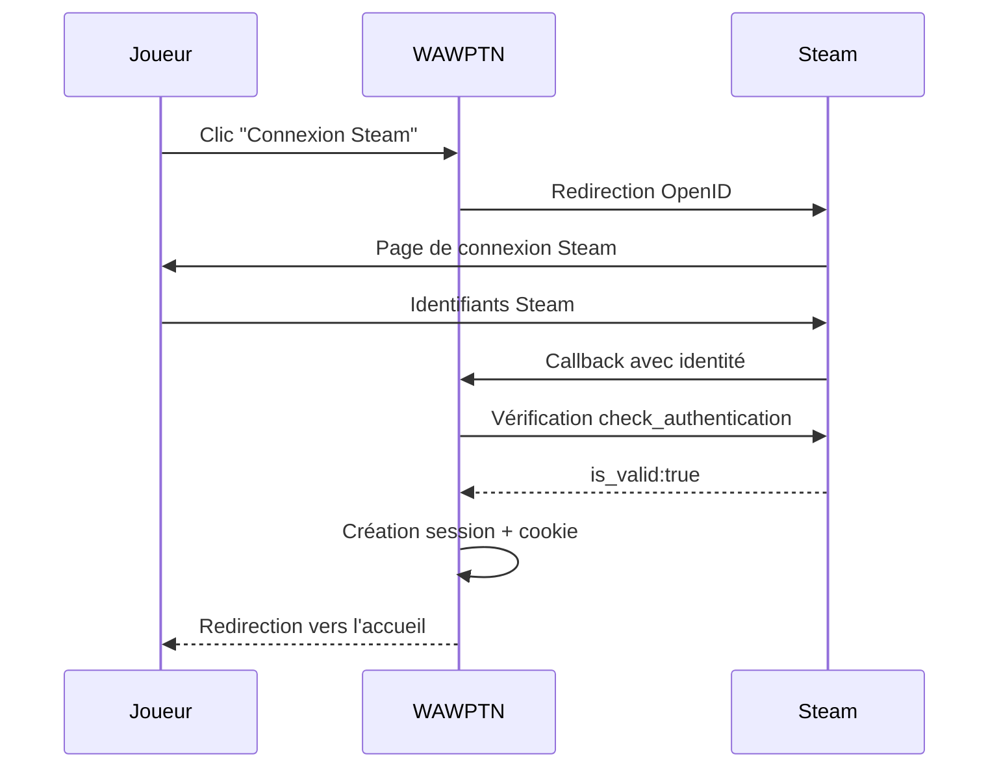
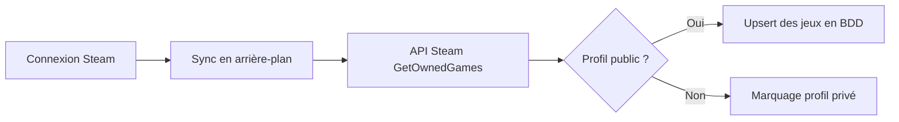

# Intégration Steam

Ce document décrit le flux d'authentification Steam OpenID 2.0, la synchronisation des bibliothèques de jeux et les mécanismes de protection contre les surcharges de l'API Steam. Il s'adresse aux développeurs et au Product Owner.

## Authentification OpenID 2.0

Steam utilise le protocole **OpenID 2.0** pour l'authentification. C'est la seule méthode de connexion de WAWPTN.

Le joueur est redirigé vers Steam pour s'authentifier. Steam renvoie un callback que WAWPTN vérifie auprès de Steam avant de créer une session locale.

### Étapes détaillées

1. **Redirection** — L'utilisateur est envoyé vers `steamcommunity.com/openid/login`
2. **Callback** — Steam redirige vers `/api/auth/steam/callback` avec les paramètres OpenID
3. **Vérification** — WAWPTN envoie une requête `check_authentication` à Steam
4. **Profil** — Récupération du pseudo et de l'avatar via l'API Steam
5. **Session** — Cookie `wawptn.session_token` créé pour 7 jours

## Synchronisation des bibliothèques

Après chaque connexion, la bibliothèque Steam du joueur est synchronisée en arrière-plan.

La synchronisation récupère tous les jeux possédés via l'API Steam. Si le profil est privé, l'utilisateur est marqué comme non visible.

### Points importants

- **Upsert** — Les jeux existants sont mis à jour, les nouveaux sont ajoutés
- **Sync manuelle** — Un propriétaire de groupe peut déclencher la synchronisation de tous les membres
- **Profil privé** — Si Steam ne retourne aucun jeu, l'utilisateur est marqué `library_visible = false`

## Mécanismes de protection

### Rate limiter

L'API Steam est limitée à **1 requête par seconde**. Un délai automatique est inséré entre chaque appel.

### Circuit breaker

Après **3 échecs consécutifs**, le circuit s'ouvre pour **5 minutes**. Pendant cette période, aucune requête n'est envoyée à Steam et les données en cache sont retournées.

| Paramètre | Valeur |
|-----------|--------|
| Seuil d'ouverture | 3 échecs consécutifs |
| Durée d'ouverture | 5 minutes |
| Après réouverture | Le compteur d'échecs est réinitialisé |

### Cache en mémoire

Les réponses de l'API Steam sont mises en cache pendant **6 heures**. Cela réduit le nombre d'appels et améliore les temps de réponse.

| Donnée mise en cache | Durée (TTL) |
|---------------------|-------------|
| Bibliothèque de jeux | 6 heures |
| Profil joueur | 6 heures |

## Clé API Steam

Une clé API Steam est obligatoire. Elle se configure via la variable d'environnement `STEAM_API_KEY`. Vous pouvez obtenir une clé sur [steamcommunity.com/dev/apikey](https://steamcommunity.com/dev/apikey).

## Autres plateformes

WAWPTN supporte également **Epic Games** et **GOG Galaxy** en complément de Steam. Ces plateformes sont optionnelles et activées par variables d'environnement.

| Plateforme | Protocole | Bibliothèque |
|------------|-----------|-------------|
| Steam | OpenID 2.0 | API GetOwnedGames |
| Epic Games | OAuth 2.0 | API bibliothèque |
| GOG Galaxy | OAuth 2.0 | API bibliothèque |

Les jeux de toutes les plateformes sont stockés dans `user_games` avec un champ `platform`. Le calcul des jeux en commun s'effectue sur l'ensemble des bibliothèques liées.
